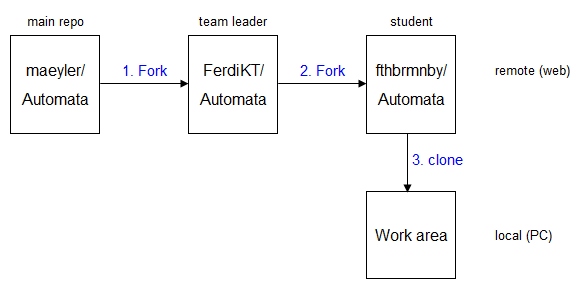
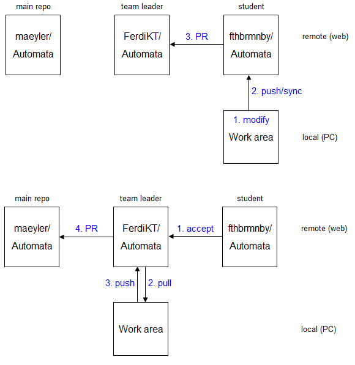
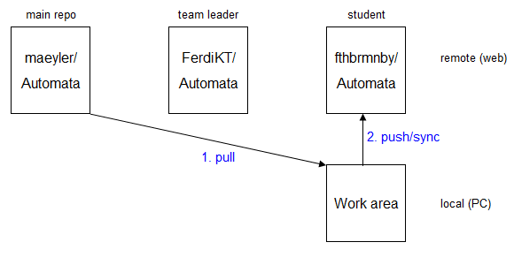

## GitHub -- İki Seviyeli İş Akışı

32 kişilik sınıfta bir ortak çalışma örneği üretmek için iki adet commit ile böyle başladık:

### Fork & Clone

GitHub iş akışı modellerinden bize en uygun olanı [Fork & Clone] (https://www.atlassian.com/git/tutorials/comparing-workflows/gitflow-workflow)

Öğrenci sayısı bir kişinin yönetebileceğinden çok fazla olduğu için birkaç takım lideri gönüllü oldu, diğer öğrenciler liderlerin reposundan kopyaladılar. Ana reponun 32 adet kopyası oldu:

Bu modelde Git'in branch özelliğini kullanmıyoruz Her repo tek daldan ibadet, ama herbiri projenin bir dalı oluyor. Bu modelin iyi tarafı şu: herkes kendi reposunun sahibi ve hiç kimseye yazma hakkı vermek gerekmiyor. 

### Branching

Öğrenciler kendi repolarına birer dosya ekleyip PR göndermeye başladılar:

### Merge

İki seviyeli yaklaşımda, takım liderleri PR'ları kabul ediyor, takımın işi tamam olunca proje sahibine PR gönderiyor:

### Update

Projenin sonunda herkes ana repodan (ya da bir arkadaşından) kendi reposunu güncelliyor:

Ana reponun diğerlerinden önemli bir farkı, hızlı kelime aramasına izin vermesi. Diğer repolarda arama özelliği yok.
